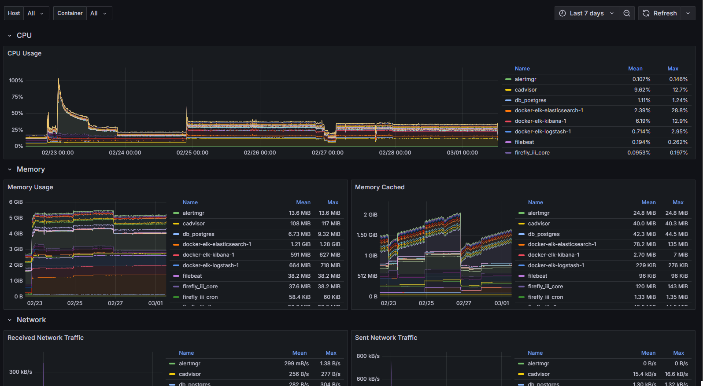

# Оглавление
1. [Задания](#Задания)
2. [Мониторинг](#мониторинг)
   2.1 [Дашборд активности пользователей в JupyterHub](#дашборд-активности-пользователей-jupyterhub)
   2.2 [Дашборд топовых тетрадок Jupyter](#дашборд-топовых-тетрадок-jupyter)
   2.3 [Дашборд топовых таблиц PostgreSQL](#дашборд-топовых-таблиц-postgresql)
   2.4 [Дашборд нагрузки сервера](#дашборд-нагрузки-сервера)
   2.5 [Дашборд нагрузки контейнеров](#дашборд-нагрузки-контейнеров)
3. [Алерты](#алерты)
   3.1 [Алерт входа по SSH](#алерт-входа-по-ssh)
   3.2 [Алерт использования процессора контейнерами выше 80%](#алерт-использования-процессора-контейнерами-выше-80)
   
---

## 1. Задания
| **Задача**       | **Описание**                                                                                     |
|-------------------|--------------------------------------------------------------------------------------------------|
| **Мониторинг**    | Дашборды должны быть **публичными**                                                              |
|                   | - Дашборд активности пользователей в Jupyter (количество операций в день)                         |
|                   | - Дашборд по топовым тетрадкам (сколько подъедают)                                                |
|                   | - Дашборд топовых таблиц в PostgreSQL с их владельцами                                           |
| **Алерты**        | - Настроить алерт при заходе пользователя на сервер по SSH на почту.                                |
|                   | - Настроить почтовый алерт при потреблении общим количеством контейнеров мощности более чем на 80%. |

---

## 2. Мониторинг
### 2.1 Дашборд активности пользователей JupyterHub

- [Ссылка на публичный дашборд](https://grafana.story-tech.ru/public-dashboards/68f835b78d6848d5bde2eda44bf77863)

  Дашборд отслеживает количество операций пользователей в JupyterHub через post запросы, анализирует активность запущенных серверов и учетных записей. Реализация через прямой сбор метрик из JupyterHub в Prometheus.


### Дашборд топовых тетрадок Jupyter
- [Ссылка на публичный дашборд](https://grafana.story-tech.ru/public-dashboards/58614ae327a4487aa84d6dc0192b7c2a)

  Реализовано с помощью [bash-скрипта](./check_volumes.sh), который записывает объем занимаемого дискового пространства тетрадками Jupyter ноутбуков. Данные обновляются каждые 10 минут через cron, собираются с помощью node-exporter, Prometheus и отображаются в Grafana.


### Дашборд топовых таблиц PostgreSQL
- [Ссылка на публичный дашборд](https://grafana.story-tech.ru/public-dashboards/034c81d55254466caf571622cbafd515)

  Реализация через прямое подключение PostgreSQL в Grafana и SQL-запросы. Также есть график с таймлайном, который берет данные с cAdvisor, но cAdvisor не отдает владельцев таблиц, их можно подсмотреть в соседней таблице или графике.


### Дашборд нагрузки сервера

  Импортирован готовый дашборд 1860-node-exporter-full для отображения общей нагрузки на сервер


### Дашборд нагрузки контейнеров

  Импортирован готовый дашборд 14282-cadvisor-exporter для отображения нагрузки на сервер контейнерами



---

## Алерты
### Алерт входа по SSH
Реализовано с использованием Postfix, PAM и bash-скрипта. Преимущество данного способа - получение алерта без задержек.

1. Устанавливаем mailutils, который включает в себя Postfix:
   ```bash
   sudo apt install mailutils
   ```
2. Настраиваем данные сервера и аутентификации в файле Postfix:
   ```bash
   sudo nano /etc/postfix/main.cf
   ```
   Добавляем:
   ```
   relayhost = [smtp.mail.ru]:465
   smtp_tls_wrappermode = yes
   smtp_sasl_auth_enable = yes
   smtp_sasl_password_maps = hash:/etc/postfix/sasl_passwd
   smtp_sasl_security_options = noanonymous
   smtp_tls_CAfile = /etc/ssl/certs/ca-certificates.crt  
   smtp_use_tls = yes
   smtp_tls_security_level = encrypt
   ```
3. Настраиваем логин и пароль в файле `/etc/postfix/sasl_passwd`:
   ```
   [smtp.mail.ru]:465 emaillogin:password
   ```
4. Устанавливаем доступ только для root:
   ```bash
   sudo chmod 600 /etc/postfix/sasl_passwd
   ```
5. Перезапускаем Postfix:
   ```bash
   sudo systemctl restart postfix
   ```
6. Настраиваем запуск [скрипта](./ssh_alert.sh) при входе по SSH:
   ```bash
   sudo nano /etc/pam.d/sshd
   ```
   Добавляем строку:
   ```
   session    required   pam_exec.so /путь_к_скрипту/ssh_alert.sh
   ```

**Результат:**
При авторизации по SSH отправляется уведомление на почту.


### Алерт использования процессора контейнерами выше 80%
Реализовано с помощью Prometheus, Alertmanager и cAdvisor.

1. Настраиваем алерт в Prometheus [alert.yml](./prometheus_stack/prometheus/alert.yml).
2. Настраиваем данные почты для отправки по SMTP в [Alertmanager](./prometheus_stack/alertmanager/alertmanager.yml.example).

**Результат:**
- Уведомление в Prometheus:
  
  
- Алерт на почте:
  
  
